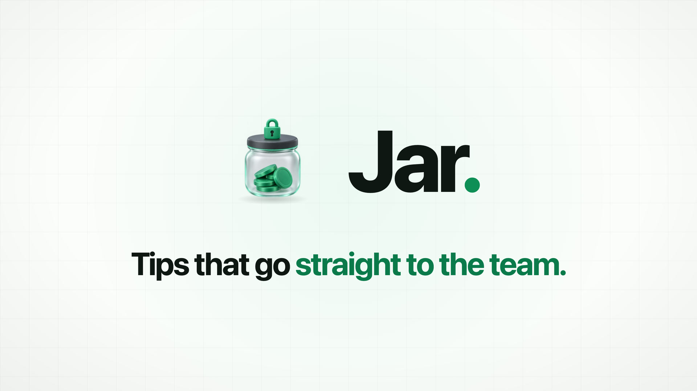
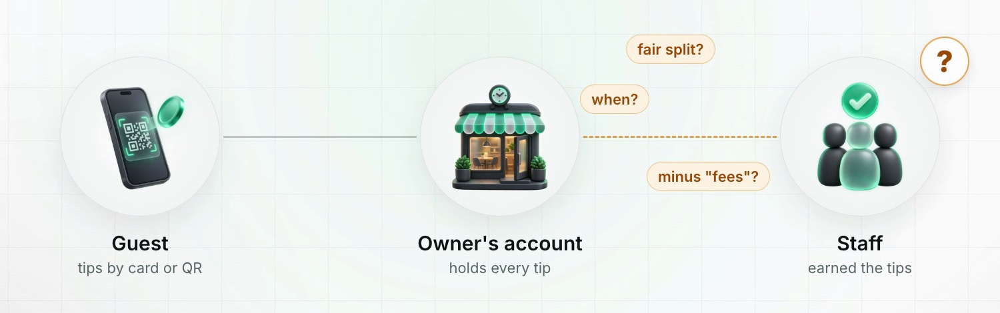
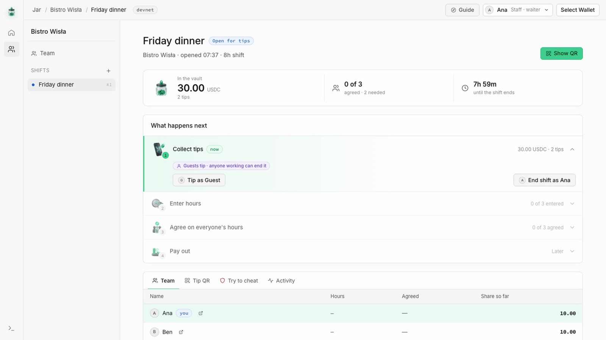
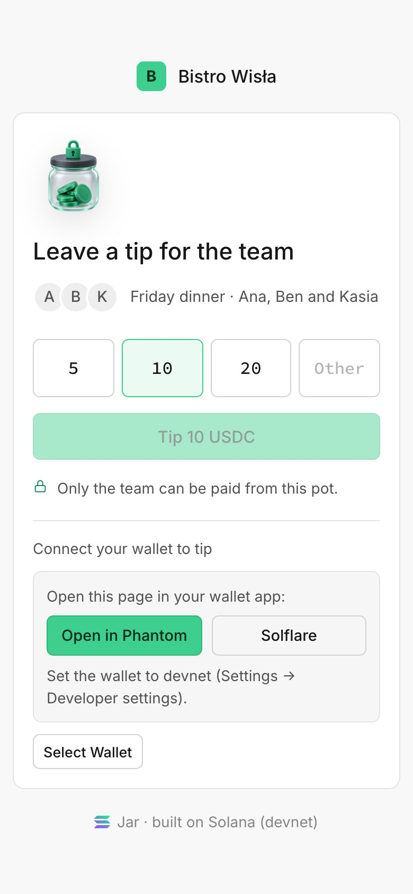
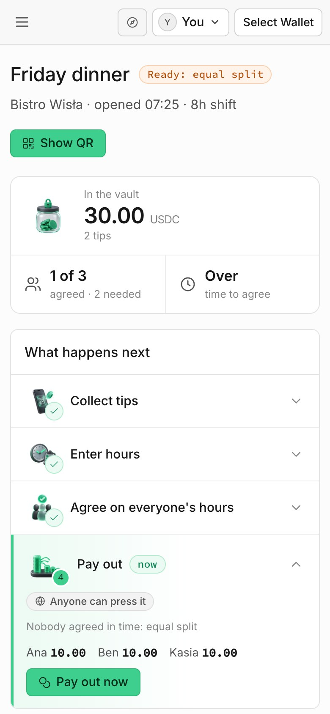
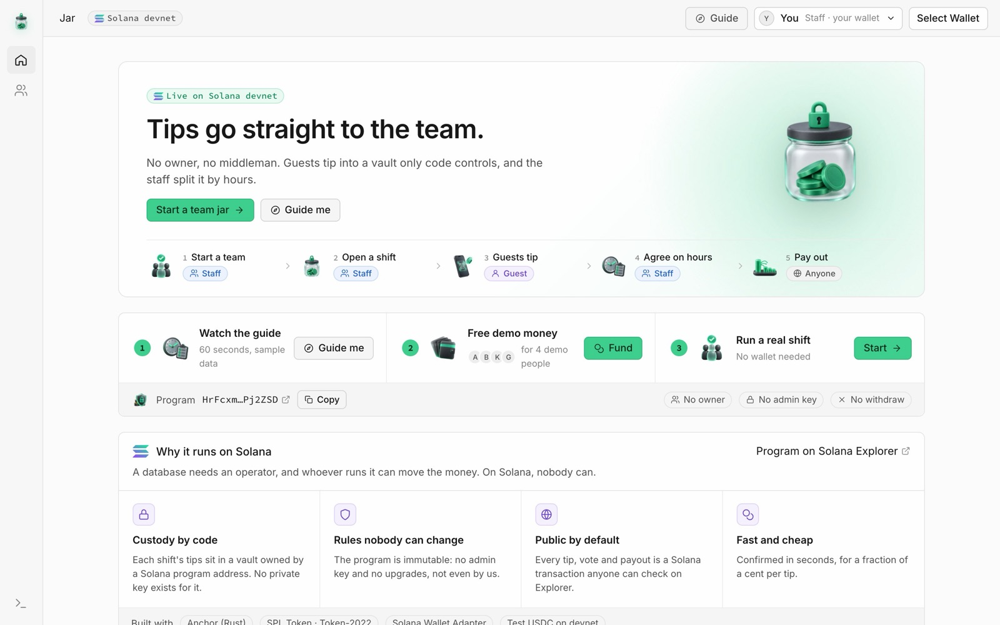
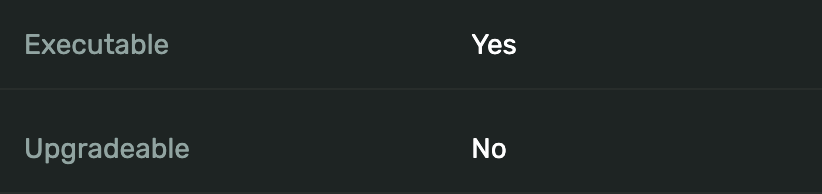

<p align="center">
  
</p>

<p align="center">
  <b>A tip jar for restaurant staff that nobody owns.</b><br>
  Guests tip by QR into a vault that only a Solana program controls.<br>
  The staff split it by hours. Nobody in between can touch it, not even the restaurant.
</p>

<p align="center">
  <a href="https://jar-tips.vercel.app"></a>
  <a href="https://explorer.solana.com/address/HrFcxm1y86UTdeJB7r8khiXfSKXSvf77p7S29MPj2ZSD?cluster=devnet"></a>
  <a href="https://explorer.solana.com/address/HrFcxm1y86UTdeJB7r8khiXfSKXSvf77p7S29MPj2ZSD?cluster=devnet"></a>
</p>

<p align="center"><sub>Superteam Poland · Finance Without Intermediaries</sub></p>

---

## The idea in one picture

<table>
  <tr>
    <th width="50%">Today</th>
    <th width="50%">With Jar</th>
  </tr>
  <tr>
    <td align="center"></td>
    <td align="center"></td>
  </tr>
  <tr>
    <td>Card and QR tips land in the <b>owner's account</b>, mixed with the bill. Staff can't see the total and have to trust the owner with the split, the timing and the "fees".</td>
    <td>Tips land in a <b>vault only code controls</b>. Everyone sees every tip, the staff agree on their hours, and the money goes <b>straight to their wallets</b>.</td>
  </tr>
</table>

## The problem

<p align="center"></p>

When a guest tips by card or QR, the tip doesn't reach the waiter. It settles into the restaurant's merchant account, and staff depend on
the owner to pass it on. Skimming is common enough that the **UK passed a law in October 2024** making employers pass on 100% of tips.
But a law still needs an inspector and a tribunal. Jar makes skimming impossible instead of illegal.

## How it works

<table>
  <tr>
    <td align="center" width="20%"><br><b>1. Start a team</b><br><sub>A waiter adds their coworkers. Nobody gets special rights; team changes need a majority vote.</sub></td>
    <td align="center" width="20%"><br><b>2. Open a shift</b><br><sub>Any team member can. The program creates a vault with no private key.</sub></td>
    <td align="center" width="20%"><br><b>3. Guests tip</b><br><sub>Scan the QR, tap 5, 10 or 20 USDC. It goes straight into the vault.</sub></td>
    <td align="center" width="20%"><br><b>4. Agree on hours</b><br><sub>Everyone enters their own hours. More than half must agree.</sub></td>
    <td align="center" width="20%"><br><b>5. Pay out</b><br><sub>Anyone presses it. The program pays each person by their hours.</sub></td>
  </tr>
</table>

The restaurant has **no account, no key and no role** in the program. There is **no withdraw button**, for anyone. If the team can't
agree in time, anyone can trigger an **equal split**, so nobody can hold the money hostage.

## See it

<p align="center"></p>

<table>
  <tr>
    <td align="center" width="50%"><br><sub><b>The guest's view.</b> Scan the QR, pick an amount, tip.</sub></td>
    <td align="center" width="50%"><br><sub><b>The staff's view.</b> The vault, the vote and the payout.</sub></td>
  </tr>
</table>

## Try it in 2 minutes

<p align="center"></p>

**On a laptop, no wallet needed**
1. Open **https://jar-tips.vercel.app**. A short guide starts by itself and lights up what to click next. Reopen it with **Guide** in the top bar.
2. Press **Fund** to get free devnet SOL and test USDC, then **Start → Play as Ana**. Ana is a waiter; Ben, Kasia and a guest live on the same laptop.
3. **Start team**, then **Propose someone** (use *Test address*) and press **Ben approves**: 2 of 3 votes adds them.
4. **New shift → Open shift as Ana**. Every button says who it acts as: **Tip as Guest**, **Save as Ana**, **Ben agrees**, **Pay out now**.
5. Open the **Try to cheat** tab and play the restaurant: withdraw the tips, redirect a share, join the shift. **All three fail on-chain.**
6. Every notification has an **Explorer** button that opens the real transaction.

Prefer your own wallet? Connect Phantom or Solflare **on devnet** and you join as one more coworker.

**On a phone:** on a shift page press **Show QR** and scan it, tap **Open in Phantom** (on devnet), **get 50 test USDC**, then **Tip**.

## Why you can trust it

| Question | Answer | Where in the code |
|---|---|---|
| Can the restaurant take the tips? | No. It has no account in the program, and the vault's only signer is a program address with no private key. | [lib.rs:518](programs/napiwek/src/lib.rs#L518) |
| Can *anyone* withdraw? | No. There is no withdraw instruction. The only way out is `settle`, and it can only pay the shift's staff. | [lib.rs:263](programs/napiwek/src/lib.rs#L263) |
| Can the person who started the team take over? | No. Their vote counts once. Adding or removing anyone needs more than half the team. | [lib.rs:79](programs/napiwek/src/lib.rs#L79), [lib.rs:417](programs/napiwek/src/lib.rs#L417) |
| Can someone redirect a share to themselves? | No. `settle` checks every payout account belongs to the person at that position, whoever calls it. | [lib.rs:285](programs/napiwek/src/lib.rs#L285) |
| Can someone fake their hours? | Not alone. More than half the shift must confirm the exact numbers; any edit voids earlier confirmations. | [lib.rs:246](programs/napiwek/src/lib.rs#L246), [lib.rs:291](programs/napiwek/src/lib.rs#L291) |
| What if nobody agrees, or people vanish? | After the confirm window, anyone can trigger an equal split. The money is never stuck. | [lib.rs:273](programs/napiwek/src/lib.rs#L273) |
| Can the rules be changed later? | No. The program is immutable: Explorer shows **Upgradeable: No**. No admin key, no pause, no fee switch. | [Explorer](https://explorer.solana.com/address/HrFcxm1y86UTdeJB7r8khiXfSKXSvf77p7S29MPj2ZSD?cluster=devnet) |

<p align="center">
  <br>
  <sub>Solana Explorer: the program can't be upgraded, so nobody can change the rules, including us.</sub>
</p>

In the demo, the restaurant tries three attacks and every transaction **lands on devnet and fails**:

1. A direct token transfer out of the vault → `owner does not match`
2. A real payout with Ana's share swapped for its own account → `WrongPayoutAccount`
3. Adding itself to the shift → `NotMember`

## Why Solana, not a database?

- **Custody without a custodian.** A database needs an operator, and whoever runs it can move the money. Here the money sits in an account only the program can sign for.
- **Anyone can check.** Every tip, vote, hours entry and payout is a public transaction. A waiter can verify the shift total on Explorer without trusting anyone.
- **Enforced before, not after.** A law needs a tribunal. The program rejects the bad transaction before it happens.
- **Cheap and fast.** A tip confirms in seconds for about $0.001 in fees.

---

## Design rationale

**Relationship:** guest → staff, today routed through the employer.
**Middleman:** the restaurant owner (with the card acquirer underneath), who holds the tips and decides who's in the pool, the split, the timing and the deductions.
**What changes:** every job the owner did now lives in the program or with the team.

| What the owner used to control | Where it lives now |
|---|---|
| Holding the tips | Each shift's vault is a token account whose only authority is the **shift PDA**. No private key exists for it ([lib.rs:518](programs/napiwek/src/lib.rs#L518)) |
| Taking money out | **There is no such instruction.** The only exit is `settle`, and it can only pay the shift's staff ([lib.rs:273](programs/napiwek/src/lib.rs#L273)) |
| Deciding who's on the team | A **majority vote of the team**: `propose` + `vote`, applied only once more than half approve ([lib.rs:79](programs/napiwek/src/lib.rs#L79), [lib.rs:417](programs/napiwek/src/lib.rs#L417)) |
| Deciding who worked tonight | Any team member opens the shift and can only pick **team members** ([lib.rs:159](programs/napiwek/src/lib.rs#L159)); anyone left out adds **themselves** ([lib.rs:176](programs/napiwek/src/lib.rs#L176)) |
| Deciding who worked how long | Each person submits **their own** minutes, capped at the shift length ([lib.rs:227](programs/napiwek/src/lib.rs#L227)) |
| Approving the split | More than half of the shift must confirm the **exact version** of everyone's hours ([lib.rs:246](programs/napiwek/src/lib.rs#L246), [lib.rs:291](programs/napiwek/src/lib.rs#L291)) |
| Redirecting a share | `settle` checks that every payout account belongs to the person at that position, whoever calls it ([lib.rs:285](programs/napiwek/src/lib.rs#L285)) |
| Deciding when people get paid | `settle` is callable by **anyone** once the rules are met: a waiter, a guest, a bot |

Our first version still had an owner who couldn't touch the money but did decide the roster, and so could slip in a fake waiter. This
version removes that role completely. The person who starts the team only pays ~0.007 SOL of account rent and gets no extra rights.

**The moment the intermediary disappears:** [`settle` in lib.rs:263](programs/napiwek/src/lib.rs#L263). The transfer authority is the
shift PDA, signed with program seeds. The destinations come from the roster stored on-chain, and the amounts from `split()`. Nothing in that
function reads anyone's signature as permission.

## Honest limitations

- **Whoever starts the team picks its first members.** That's the one moment of trust: the founder could list a fake coworker. It's public, the real coworkers see it before working a shift, and they can vote the fake out once they're a majority. Real identity (a code from the staff room, or a payroll attestation) is on the roadmap.
- **Majority rule is only as honest as the majority.** If most of a team colludes, they can outvote the rest. Hours are peer-checked and the fallback is an equal split, so inflating your own hours doesn't pay.
- **Names are on-chain.** First names or nicknames only, max 16 bytes.
- **Pooled tips only.** A QR tips the whole shift, not one waiter. Per-waiter tips are a planned extension.
- **The demo funding key is public.** `app/src/sponsor-keypair.json` is a devnet-only "gas station" so judges can play without a wallet. Like the test-USDC faucet key, it's public on purpose and controls nothing in the program.
- **Off-ramp.** Staff receive USDC; turning it into złoty is a separate step (an exchange or a stablecoin card). The demo uses devnet test USDC.

<details>
<summary><b>Rules: who can do what</b></summary>

| Who | Can | Cannot |
|---|---|---|
| **Team member** | propose adding/removing a coworker, vote on the open proposal, open a shift for team members, add **themselves** to a shift, end a shift they work early, submit **their own** minutes, confirm everyone's hours at a given version | change the team alone, add someone else to a shift, edit someone else's hours, confirm a version that has since changed, withdraw |
| **Guest** | tip any amount into the vault (via `tip`, or by sending tokens to the vault directly; both are shared) | — |
| **Anyone** (incl. the restaurant) | trigger `settle` once the rules allow it | choose who gets paid or how much, join a team or shift, take anything out of a vault |

**Team votes.** One proposal at a time. The proposer's vote counts immediately; it passes when more than half of the current team has
approved (2 of 3, 3 of 4, …). `vote(id)` names the proposal, so nobody can be tricked into approving a different one that replaced it.
Only the proposer can replace an open proposal, or anyone once it's 24 h old, so a stale vote can't block the team.

**Confirmation versioning.** Every hours change or roster addition bumps `shift.version` and voids all earlier confirmations. `confirm(version)` fails
with `StaleVersion` if the numbers changed after you looked, so nobody can be tricked into signing off on edited hours.

**The split.** Majority confirmed → pro-rata by minutes. Rounding dust goes to the longest shift so the vault ends at exactly zero, and it is
then closed so no late tip can get stuck. The rule is mirrored in the UI's live preview (`app/src/solana.ts`).

</details>

<details>
<summary><b>What happens if someone vanishes halfway?</b></summary>

| Situation | Where the money is | What happens |
|---|---|---|
| Whoever opened the shift disappears | In the vault (PDA) | Nothing changes. The shift closes at its scheduled end on its own; the others confirm and anyone pays out. |
| Nobody ends the shift | In the vault | `closes_at` was fixed at opening (scheduled length). After it, the shift is over by definition. |
| Someone was left off the shift | In the vault | If they're on the team, they add themselves with `join_shift`, which resets confirmations so everyone re-checks. |
| One waiter never confirms | In the vault | Only a majority is needed. Their share is still paid to them by the hours they submitted (0 if they didn't). |
| Nobody agrees / everyone vanishes | In the vault | After `closes_at + confirm_window`, **anyone** can settle and the pot is split **equally** across the shift. Nobody can hold it hostage. |
| A waiter closed their token account | In the vault | The client recreates it idempotently before `settle`, so a payout can't be blocked. |
| A guest tips after payout | Their own wallet | The vault was closed in `settle`, so the transfer fails instead of stranding funds. |
| Someone pre-creates the next vault address to block a shift | — | `open_shift` uses `init_if_needed` and only accepts the shift's own token account; anything already in it is shared like a tip. |

</details>

<details>
<summary><b>Can anything be changed after deploy?</b></summary>

- **Per shift:** no. Mint, roster (add-only, team members only), shift length, confirm window and the split rule are fixed when the shift opens.
- **Per team:** only membership, and only by majority vote. Mint and confirm window are fixed when the team starts.
- **The program:** no. Its upgrade authority was removed with `solana program set-upgrade-authority … --final`, so nobody can change the
  rules, including us. Solana Explorer shows **Upgradeable: No**.
- **No admin key, no pause, no fee switch** exists in the code.

</details>

<details>
<summary><b>Full demo script (live, devnet)</b></summary>

**One laptop plays every role.** Ana, Ben, Kasia, a guest and "the restaurant" (an outsider with no rights) are devnet keypairs kept in the
browser; a connected Phantom/Solflare wallet can join the team too. Buttons name who they act as, and the top bar switches who signs.
The program can't tell them apart from Phantom.

1. **Overview → Fund** (devnet SOL for the demo people, 200 test USDC to the guest)
2. **Team → Play as Ana → Start team** (Ana, Ben, Kasia; time to agree: 1 minute)
3. **Propose someone** → name + *Test address* → **Propose** (1 of 3) → **Ben approves** (2 of 3, added)
4. **New shift** "Friday dinner", 8 h, everyone ticked → **Open shift as Ana**
5. Shift page → step 1 **Tip as Guest** (or **Show QR** and scan it) → tip 10 and 20 USDC
6. **Try to cheat** tab → withdraw, redirect, join → open the Explorer links: **failed on-chain**
7. **End shift as Ana** → enter 8 / 6 / 4 hours → Ana and Ben press **agrees** (2 of 3)
8. **Pay out now** → Ana 13.33 · Ben 10.00 · Kasia 6.67 · restaurant 0 → open in Explorer

Variant: skip step 7's confirmations, wait out the 1-minute window and show the equal-split fallback.

The end-to-end script (`app/scripts/e2e-devnet.ts`) runs the same flow against devnet: a team vote to add and remove a coworker, four outsider
attacks rejected, 65 USDC tipped, 8 h / 6 h / 4 h.

</details>

<details>
<summary><b>Run it locally</b></summary>

Prerequisites: Node 20+, a devnet wallet with ~0.2 SOL. Program build/deploy needs Rust 1.89, Agave 3.x, Anchor CLI 1.x.

```bash
cd app
npm install
cp .env.example .env.local   # optional: a private devnet RPC, and VITE_PUBLIC_URL for QR codes
npm run dev                  # http://localhost:5174
```

End-to-end check against the deployed program (funds throwaway keypairs from `~/.config/solana/id.json`):

```bash
cd app
npx tsx scripts/e2e-devnet.ts            # majority path
npx tsx scripts/e2e-devnet.ts --timeout  # equal-split fallback
```

Or against a local validator, no devnet SOL needed:

```bash
solana-test-validator --reset --url devnet --clone CuVBzJkeKCsLgCctJjSkQzy5TXyG7QZwhXMFYEVPCaSn \
  --bpf-program HrFcxm1y86UTdeJB7r8khiXfSKXSvf77p7S29MPj2ZSD target/deploy/napiwek.so
solana airdrop 10 -u localhost
cd app && RPC_URL=http://127.0.0.1:8899 npx tsx scripts/e2e-devnet.ts
```

Build the program and run its tests:

```bash
anchor build
cargo test -p napiwek                    # split() and majority maths
cp target/idl/napiwek.json target/types/napiwek.ts app/src/idl/
```

The devnet program is immutable, so a changed program has to be deployed under a new program ID.

</details>

<details>
<summary><b>Repo map</b></summary>

```
programs/napiwek/src/lib.rs   the whole program: instructions, accounts, split(), votes, errors
app/src/solana.ts             PDAs, instruction builders, status + split preview, activity feed
app/src/actors.tsx            who signs: browser wallet + demo keypairs, send/confirm with retries
app/src/data.ts               polling hooks for the team, shifts and the vault balance
app/src/App.tsx               app shell: rail, top bar, signer switcher, one-at-a-time transactions, toasts
app/src/pages/Overview.tsx    what it is + how to try it
app/src/pages/Team.tsx        start a team, members and votes, open a shift, shift list
app/src/pages/ShiftView.tsx   shift page: summary, four steps with a button per person, tabs (team, QR, try to cheat, activity)
app/src/pages/TipPage.tsx     guest QR tip page (no crypto jargon)
app/src/Tour.tsx              guided spotlight tour (15 steps): dims the page, lights the next control
app/public/icons/             3D illustrations, generated with Higgsfield (GPT Image 2.5)
app/scripts/e2e-devnet.ts     full flow incl. votes and outsider attacks
app/scripts/fund.ts           fund any wallets with devnet SOL + test USDC
app/scripts/check-tx-size.mts proves a 12-person team's transactions fit Solana's 1232-byte limit
docs/                         submission text, demo checklist, README images
```

</details>

## From demo to product

- **Who pays:** teams or venues pay a small monthly fee for the app. Never a cut of tips.
- **POS integration:** print the shift QR on the receipt; accept card tips through an on-ramp that settles into the vault as USDC.
- **Staff identity:** join a team with a one-time code from the staff room, so the founder can't invent people; payroll export for tax reporting.
- **Points / roles:** weighted shares (e.g. kitchen 0.5×) voted on by the team and fixed at shift open, visible to everyone before the shift starts.

---

<p align="center">
  <b>Stack:</b> Anchor 1.x (Rust) · SPL Token / Token-2022 via <code>token_interface</code> · React + Vite · Wallet Adapter (Wallet Standard)<br>
  <b>Program (devnet):</b> <a href="https://explorer.solana.com/address/HrFcxm1y86UTdeJB7r8khiXfSKXSvf77p7S29MPj2ZSD?cluster=devnet"><code>HrFcxm1y86UTdeJB7r8khiXfSKXSvf77p7S29MPj2ZSD</code></a> · on-chain name <code>napiwek</code>, Polish for "tip"
</p>
