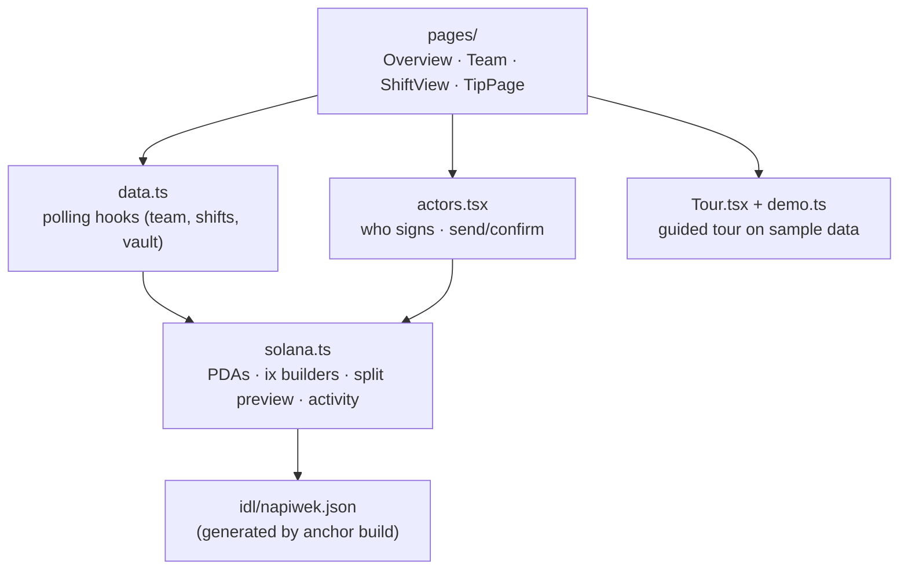

# Client architecture

The web app is a static React 19 + Vite site with **no backend**. It reads accounts from a Solana RPC node and sends transactions that the program validates. Anything the app shows can be checked on-chain, and anything it does could be done by another client using the public IDL.

## Layers



| File | Responsibility |
|---|---|
| `main.tsx` | `ConnectionProvider` (commitment `confirmed`, no automatic 429 retry), `WalletProvider` with an **empty adapter list** (Phantom, Solflare and Backpack register through the Wallet Standard), `ActorProvider` |
| `solana.ts` | `teamPda`, `shiftPda`, `vaultOf`, one builder per instruction, `missingAtaIxs`, `previewShares`/`split`, `phaseOf`/`canSettle`/`stageOf`, activity-feed decoding, `explainFailure` |
| `actors.tsx` | The signer abstraction: the connected wallet plus five demo keypairs. `send()` with rebroadcast. `fundCrew()` through the devnet sponsor |
| `data.ts` | `useTeamData`, `useShift`, `useShiftTeam`, `useSol`: polling that never overlaps and keeps the last good value on RPC errors |
| `hooks.ts` | `useHashRoute` (hash routing: works on any static host), `useChainNow` (clock corrected towards the cluster's block time, so countdowns match what the program will see), `useInterval` |
| `demo.ts` | Sample team and shift shown while the tour runs. Nothing touches the chain |
| `pages/TipPage.tsx` | The guest page opened from the QR code (`#/tip/<shift>`): amount buttons and no crypto jargon. On a phone, it deep-links into Phantom's or Solflare's in-app browser |

## The actor model: one laptop, every role

```ts
type ActorId = "wallet" | "ana" | "ben" | "kasia" | "guest" | "outsider";
```

- **Ana, Ben, Kasia, the guest and the restaurant** are `Keypair`s generated once and kept in `localStorage`. They are ordinary signers, and the program can't tell them apart from Phantom.
- **The restaurant** is an outsider with no rights, there only so the demo can show its attempts failing.
- **The connected wallet** can join the team as one more coworker.
- Every button names who it acts as (**Save as Ana**, **Ben agrees**), and the top bar switches the active signer.

This isn't a privileged mode. The same instructions, accounts and checks apply whether a demo keypair or a hardware wallet signs.

## Mirroring the program

The UI never decides anything the program decides. It previews the outcome with ports of the on-chain rules, so people can see the result before they sign:

| On-chain (Rust) | Client mirror (TS) |
|---|---|
| `split()` | `split()` / `previewShares()` with `bigint` |
| `passes()` | `majorityOf(n)`, `votedBy()` |
| `confirmations() * 2 > n` | `confirmations()`, `hasMajority()`, `needed()` |
| checks at the top of `settle` | `phaseOf()`, `canSettle()` |

If the two ever disagreed, the program would win: a transaction built on a wrong preview fails on-chain.

## Reading on-chain state

- Accounts are fetched with the Anchor coder from the IDL (`program.account.team.fetchNullable`, `shift.fetchMultiple`).
- Balances for many wallets come from **two** `getMultipleAccountsInfo` calls, reading the SPL amount at byte offset 64.
- The activity feed calls `getSignaturesForAddress` (last 10), fetches each transaction **once** (transactions are immutable, so they are cached), and labels it from the `Instruction: X` log line or from known failure strings.
