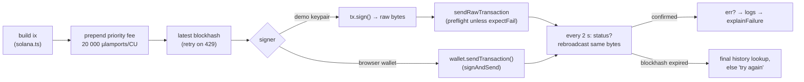

# Sending transactions

Devnet regularly drops transactions that are sent only once. A demo that fails in front of a jury is worse than none, so `send()` in `app/src/actors.tsx` is built to be reliable.

## The send pipeline

## Details

- **Priority fee.** Each transaction gets `ComputeBudgetProgram.setComputeUnitPrice({ microLamports: 20_000 })`, about 0.000004 SOL, so a busy devnet leader still includes it.
- **Rebroadcast until confirmed.** Every 2 s the client checks the signature status and re-sends **the same signed bytes**. This is safe because a signature can only land once. Every third tick it checks whether the block height has passed `lastValidBlockHeight`, and gives up only then.
- **One last look.** Before reporting failure, it calls `getSignatureStatuses(..., { searchTransactionHistory: true })`, in case the transaction landed just as the blockhash expired.
- **Browser wallets** use `sendTransaction`, which maps to Phantom's recommended `signAndSendTransaction`. A sign-only request from an unknown site triggers extra wallet warnings. The app still watches for confirmation itself.
- **Rate limits.** User actions retry on HTTP 429 with exponential back-off (600 ms · 2ⁱ, 5 tries). Background polling doesn't retry. It waits for the next tick.
- **Failures with an Explorer link.** `expectFail: true` skips preflight so a rejected attack lands on-chain. After confirmation, the client fetches the logs and `explainFailure()` turns them into one sentence: the Anchor `Error Message`, the Token program's `owner does not match`, or the custom error text.

## Transaction size budget

Solana transactions are capped at **1232 bytes**. With a full 12-person roster:

| Transaction | Bytes |
|---|---|
| `create_team`, 12 members | 970 |
| `open_shift`, 12 staff | 828 |
| `settle`, 12 staff (12 remaining accounts) | 707 |
| 4 × create-ATA (one chunk) | 558 |

Staff token accounts are therefore **not** created inside `open_shift`: that combination would be 1716 bytes. Before `settle`, `missingAtaIxs()` creates any missing ones idempotently, in chunks of 4 per transaction, so a closed account can never block a payout.

## Demo funding

`fundCrew()` gives each demo keypair just enough SOL (Ana 0.03, others 0.01, the restaurant 0.004) and mints 200 test USDC to the guest. The connected wallet pays if it can afford it. Otherwise the bundled devnet **sponsor** key pays, so a judge with no wallet can still run everything. The test-USDC mint authority is also a bundled devnet key (`faucet-keypair.json`). Neither key has any role in the program.
