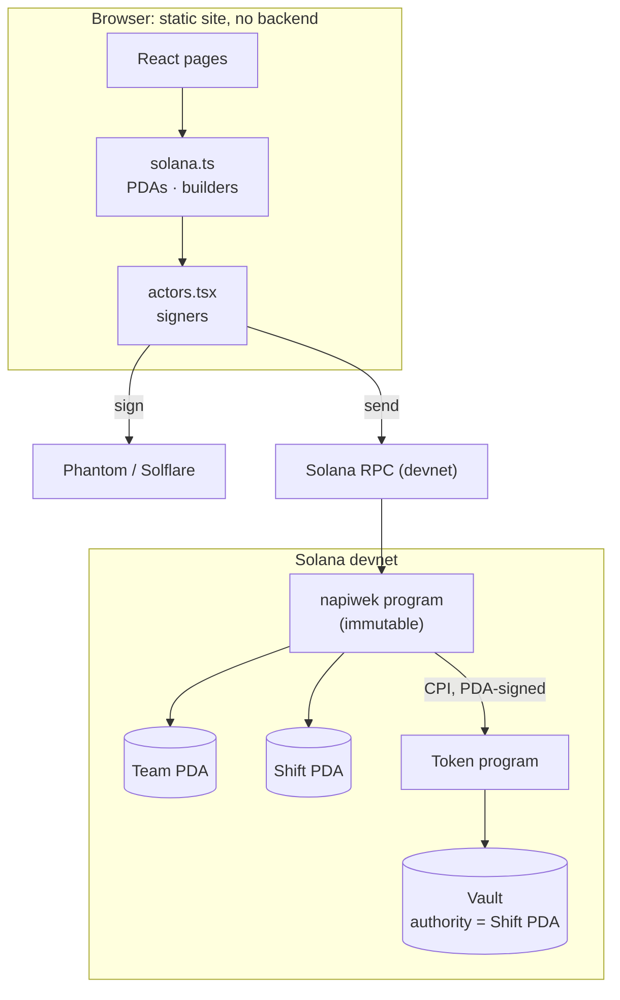

# Architecture

Jar has two parts: an Anchor program on Solana that holds and splits the money, and a static React app that builds transactions for it. **There is no backend.** The app talks directly to a Solana RPC node, and every state change is a signed transaction that the program validates.

## Components

| Part | Files | Role |
|---|---|---|
| **Program** | [`programs/napiwek/src/lib.rs`](https://github.com/AyhanSh/jar-tips/blob/main/programs/napiwek/src/lib.rs) | The 10 instructions, 2 account types, `split()`, the majority check, 21 errors and 9 events, all in one file |
| **IDL** | `target/idl/napiwek.json` → `app/src/idl/` | Generated by `anchor build`. The client uses it for typed instruction builders and account decoding |
| **Chain layer** | [`app/src/solana.ts`](https://github.com/AyhanSh/jar-tips/blob/main/app/src/solana.ts) | PDA derivation, one builder per instruction, the split preview (a port of the Rust rule), and decoding of the activity feed |
| **Signing** | [`app/src/actors.tsx`](https://github.com/AyhanSh/jar-tips/blob/main/app/src/actors.tsx) | Who signs (browser wallet or demo keypair), plus send/confirm with rebroadcast and 429 back-off |
| **State** | [`app/src/data.ts`](https://github.com/AyhanSh/jar-tips/blob/main/app/src/data.ts) | Polling hooks for the team, its shifts and the vault balance. Sample data while the tour runs |
| **Pages** | `app/src/pages/*.tsx` | Overview, Team (votes, open shift), Shift (four steps, QR, *Try to cheat*, activity), guest Tip page |
| **Scripts** | `app/scripts/` | `e2e-devnet.ts` (full flow and attacks), `fund.ts`, `check-tx-size.mts` |

## Design choices worth noting

- **One program file.** A reviewer can read all of the trust-relevant code in one sitting. Nothing is hidden behind other crates beyond `anchor-lang` and `anchor-spl`.
- **The vault is an ATA owned by a PDA.** Its address is deterministic (`ATA(mint, shiftPDA)`), so a guest's wallet can send tokens straight to it and they are still shared. See [`settle`](/program/settle#_3-how-it-is-split).
- **Fixed-size accounts.** `MAX_STAFF = 12` and byte-bounded names give the `Team` and `Shift` accounts a fixed size (via `InitSpace`), so they never need reallocating.
- **The payout is permissionless.** Settlement doesn't depend on any particular person, server or cron job being online.
- **No indexer.** The app reads accounts directly and decodes recent transaction logs for the activity feed, which keeps the trusted surface to the program and an RPC node.
