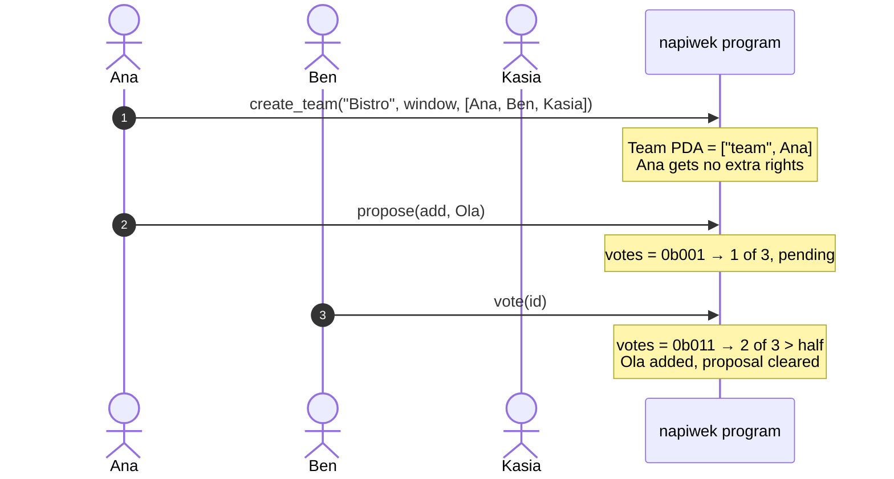
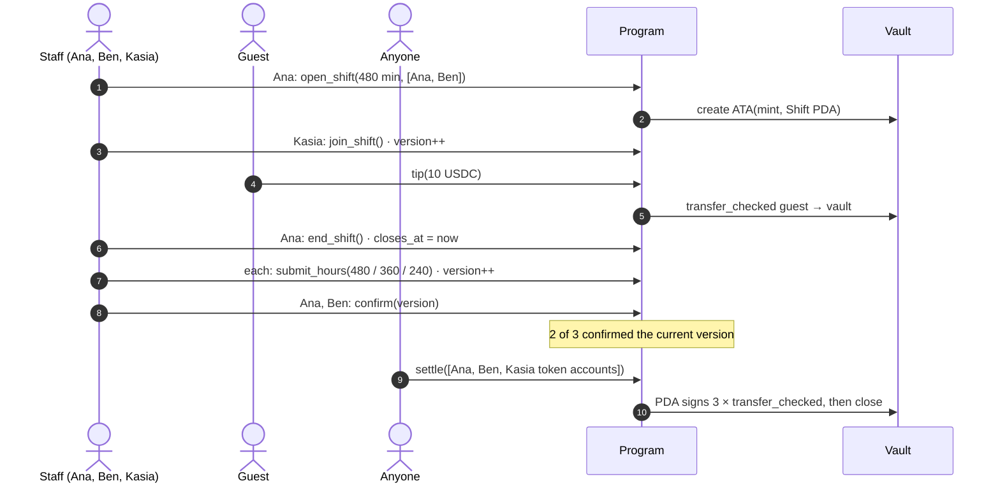
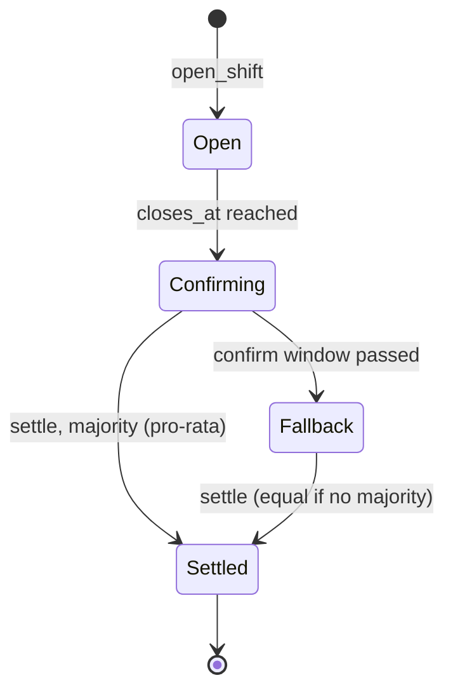

# Lifecycle of a shift

## Team setup and votes

## A shift, start to payout

## Shift phases

The program has no explicit state enum. A shift's phase follows from the clock and its fields. The client mirrors this exact logic in `phaseOf` and `canSettle` (`app/src/solana.ts`).

| Phase | Condition | Allowed |
|---|---|---|
| **Open** | `now < closes_at` | `tip`, `join_shift`, `end_shift`, `submit_hours` |
| **Confirming** | `closes_at ≤ now < closes_at + confirm_window` | the above, plus `confirm(version)`. `settle` works only with a majority |
| **Fallback** | `now ≥ closes_at + confirm_window` | everything, and `settle` always succeeds (equal split if there is no majority) |
| **Settled** | `settled == true` | nothing. The vault is closed, so late tips fail instead of getting stuck |

::: info Why hours can still change after the shift closes
`submit_hours` is allowed until settlement so people can fix mistakes. Every change bumps `version`, which voids all earlier confirmations, so a late edit can't sneak past people who already agreed.
:::
