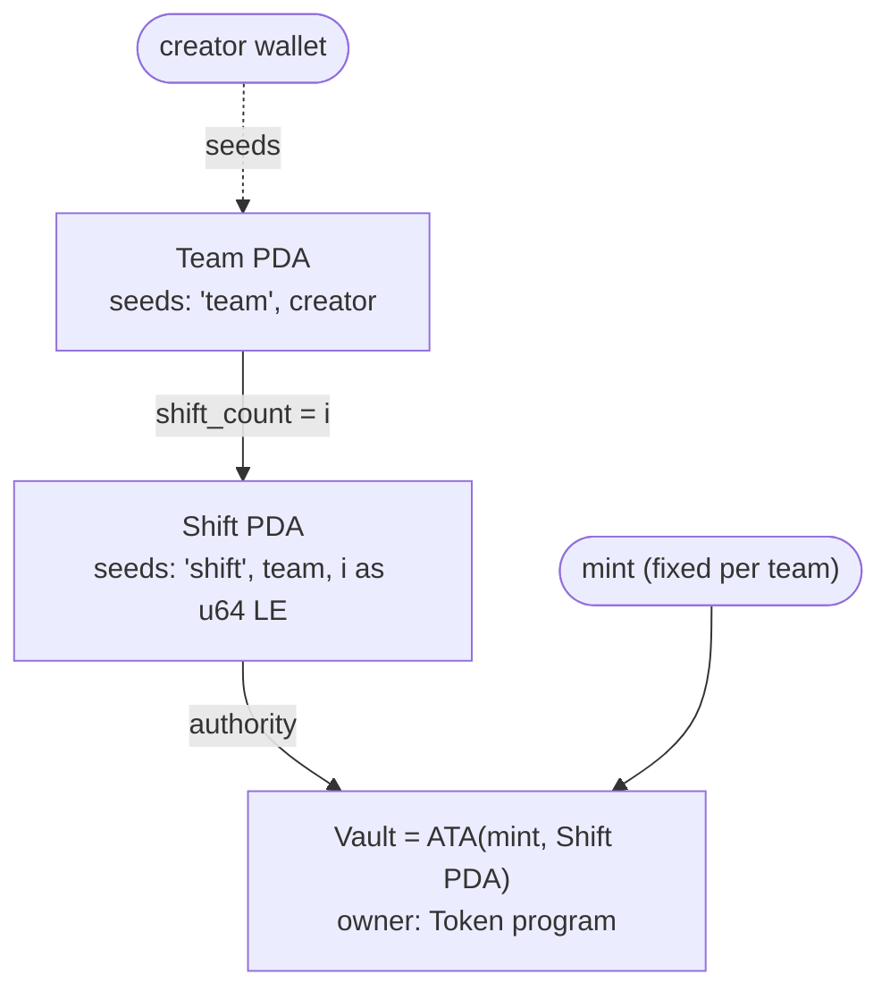

# Accounts and PDAs

The program owns two account types, `Team` and `Shift`. Each shift also has a token **vault**, owned by the token program, whose authority is the shift PDA.

## Address derivation

| Account | Seeds | Client helper |
|---|---|---|
| Team | `["team", creator]` | `teamPda(creator)` |
| Shift | `["shift", team, index.to_le_bytes()]` (u64) | `shiftPda(team, index)` |
| Vault | Associated token address of `(mint, shift)` with `allowOwnerOffCurve` | `vaultOf(shift)` |

One team per creator wallet. The creator key only **seeds the address**. `Team.creator` is never read by any instruction for authorization.

::: tip Why a PDA-owned vault is custody without a custodian
A PDA lies off the ed25519 curve, so **no private key exists for it**. Only the program that derived it can produce a signature for it, by calling `invoke_signed` with the seeds. The napiwek program does that in exactly one place: inside [`settle`](/program/settle), towards the shift's own roster.
:::

## `Team`

[lib.rs:606](https://github.com/AyhanSh/jar-tips/blob/f36acc298f7e6e669d7ca984a7822c684bd5bc47/programs/napiwek/src/lib.rs#L606) · 857 bytes including the discriminator · ≈0.0069 SOL rent

| Field | Type | Notes |
|---|---|---|
| `creator` | `Pubkey` | Paid the rent and seeds the address. **No rights** |
| `mint` | `Pubkey` | Tip currency, fixed at creation |
| `name` | `String` (≤32 B) | |
| `confirm_window` | `i64` | Seconds after a shift closes before the equal split is allowed |
| `shift_count` | `u64` | Next shift index |
| `bump` | `u8` | |
| `members` | `Vec<Member>` (≤12) | `{ wallet, name ≤16 B }`. **The order matters**: bit *i* of a vote mask is `members[i]` |
| `proposal_count` | `u32` | Monotonic proposal id |
| `proposal` | `Option<Proposal>` | At most one open proposal |

**`Proposal`**: `id: u32`, `add: bool`, `wallet`, `name`, `proposer`, `created_at: i64`, `votes: u16` (bitmask over `members`).

## `Shift`

[lib.rs:645](https://github.com/AyhanSh/jar-tips/blob/f36acc298f7e6e669d7ca984a7822c684bd5bc47/programs/napiwek/src/lib.rs#L645) · 1017 bytes including the discriminator · ≈0.008 SOL rent

| Field | Type | Notes |
|---|---|---|
| `team` | `Pubkey` | Parent team |
| `opened_by` | `Pubkey` | Paid rent. Gets the **vault's** rent back at settle, never tips |
| `mint` | `Pubkey` | Copied from the team |
| `index` | `u64` | Part of the PDA seeds |
| `bump` | `u8` | Used as signer seed in `settle` |
| `label` | `String` (≤32 B) | |
| `opened_at`, `closes_at` | `i64` | `closes_at = opened_at + scheduled_minutes·60`. It can only move earlier |
| `scheduled_minutes` | `u16` | Cap for each person's `minutes` |
| `confirm_window` | `i64` | Copied from the team at opening, so a later team change can't affect a running shift |
| `version` | `u32` | Starts at 1. **Bumped on every roster or hours change** |
| `total_tipped`, `tip_count` | `u64`, `u32` | Through `tip` only (direct transfers are still paid out) |
| `settled`, `settled_at`, `by_timeout`, `paid_out` | | Written once by `settle` |
| `staff` | `Vec<StaffEntry>` (≤12) | Roster. **The order defines payout account order** |

**`StaffEntry`**: `wallet`, `name`, `minutes: u16`, `submitted: bool`, `confirmed_version: u32`, `paid: u64`.

A person's confirmation counts only while `confirmed_version == shift.version`, so a version bump voids every confirmation without touching each entry.

## Rent and who pays

| Account | Paid by | Returned? |
|---|---|---|
| Team | creator | No. The team persists |
| Shift | opener | No. It stays as the public record of the shift and its payout |
| Vault (165-byte token account, ≈0.002 SOL) | opener | **Yes**, closed in `settle` and sent to `opened_by` |

Size calculations follow Anchor's `InitSpace` rules: strings and vectors count their 4-byte length prefix plus the maximum length, and an `Option` adds 1 byte.
